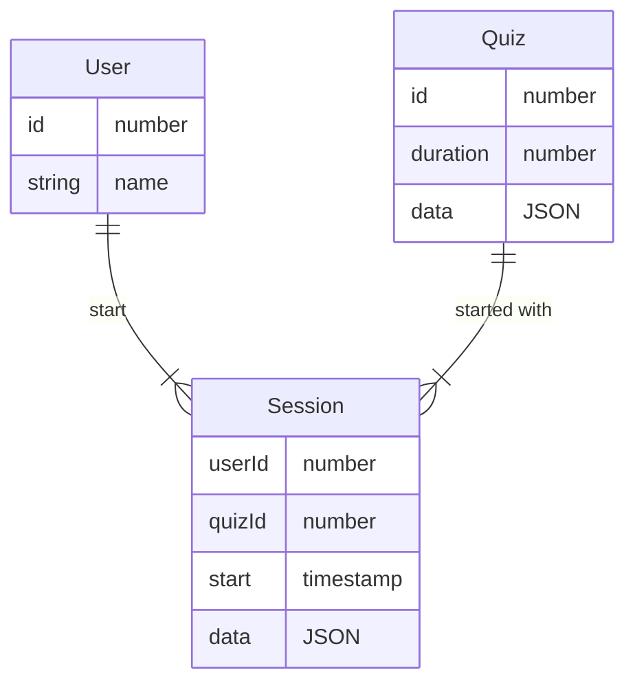

db objects
->
nest dtos
->
zod schemas
->
generated openai client types

QuizSession
  quizId
  keyHash
  startedAt
  
  status : "in-progress" | "completed"
  questions: Question[]

  feedback?: QuizFeedback

POST api/sessions
  создает сессию
  при создании ориентироваться на соответствующий Quiz

UPDATE api/sessions
  обновляет сессию по ключу
  ориентироваться на время запроса
  при статусе "completed" проводить расчет feedback

POST api/sessions/resolve
  получает сессию по ключу

Answer
  indices: number[]

Question
  score
  description
  answer: Answer

Quiz
  title
  description

  questions: Question[]

QuestionFeedback:
  score
  maxScore

  rightAnswer
  currentAnswer

QuizFeedback
  score
  maxScore
  questions: QuestionFeedback[]